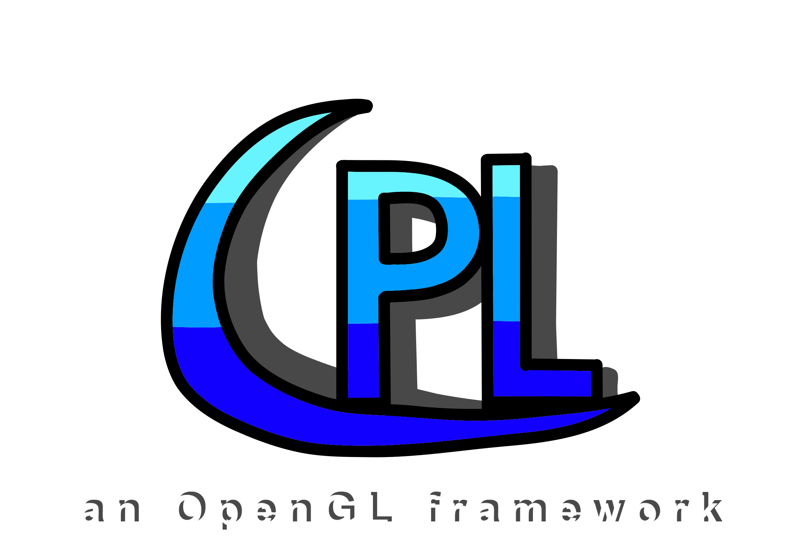
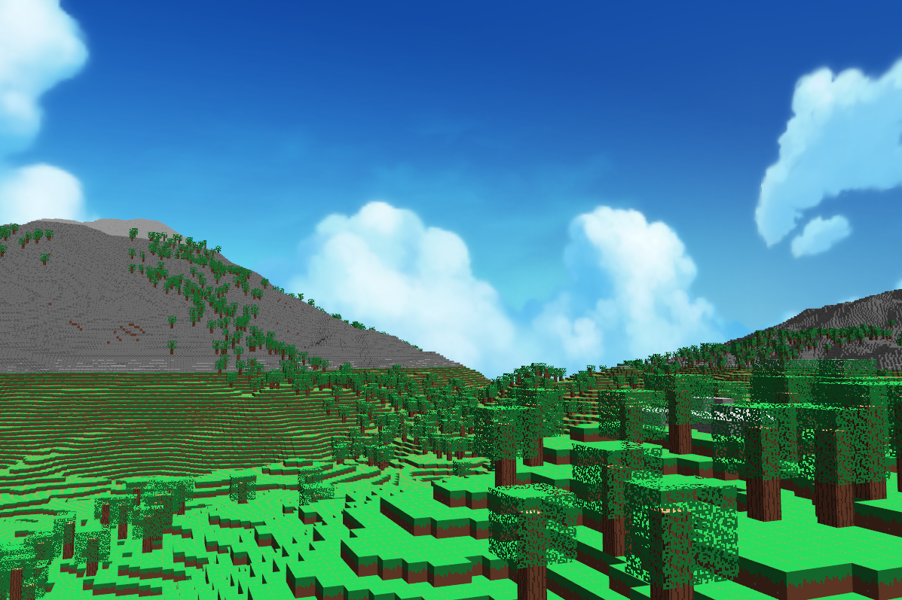
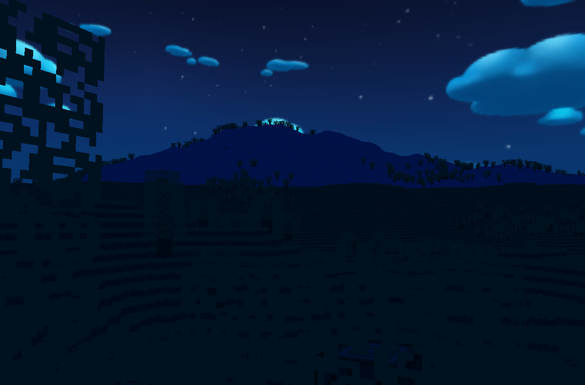

# CPLibrary (CPL)

## About
CPL (named by me) is my custom framework made from scratch. This framework is entirely written \
in C++ 17 and uses OpenGL & other low-level libraries like GLFW, GLAD, STBImage etc. \
Currently I worked on this just for around 3-4 months

## Example code
```
#include "../CPLibrary/CPLibrary.h"

using namespace CPL;
PRIORITIZE_GPU_BY_VENDOR // optional

int main() {
    InitWindow({800, 600}, "Welcome to CPL");

    while (!WindowShouldClose()) {
        UpdateCPL();

        ClearBackground(BLACK);
        
        BeginDraw(DrawModes::SHAPE_2D, true);
        DrawRect({0, 0}, {100, 100}, RED);

        BeginDraw(DrawModes::TEXT, false);
        DrawText({GetScreenWidth() / 2, GetScreenHeight() / 2}, 
            1.0f, "Hello OpenGL", WHITE);

        EndDraw();
        EndFrame();
    }

    CloseWindow();
}
```

This will be the result if you start the program with the given code:


A proper example code for 3D can be found inside the `example3D/` folder and for 2D inside `example2D/`! Currently there is also a Minecraft Clone, a project of mine I am working on inside `src/` but probably I will make a seperate project out of it.

As you can see, the functions and naming conventions are pretty similar \
and inspired by the ones from Raylib

## Games/Projects where I used CPL
It is not much yet but these are the projects and their link to GitHub:

> [!IMPORTANT]
> All these project use an older version of CPL so do not get confused by that

- [Flappy Bird Clone](https://github.com/ColinIndieDev/Flappy-Bird-Clone)
- [Digit Recognition AI](https://github.com/ColinIndieDev/Digit-Recognition-AI)

There is also a demo here a Minecraft Clone made using my framework, repo will be linked soon! \
Here are some screenshots from earlier prototypes:





## Structure
+ `assets/`
+ + `fonts/`
+ + `images/`
+ + `shaders/`
+ + + `default/`
+ + + + `frag/*.frag`
+ + + + `vert/*.vert`
+ + + `web/`
+ + + + `frag/*.frag`
+ + + + `vert/*.vert` 
+ `CPLibrary/`
+ + `cmake/`
+ + `external/`
+ + + `glad/`
+ + `include/`
+ + `src/`
+ + `CMakeLists.txt`

The `assets/` folder is important since it contains the default font of the framework if the user has not chosen one and the shader code. In `external/` is the implementation from `glad/` downloaded from its offical website.
All code for the shaders like fragment as well as vertex are all stored inside the
`shader/` folder and sorted (in assets as mentioned before). All `.h` and `.cpp` files for CPL are seperated. Inside `shapes2D/`, classes of primitves (rectangle, circle etc.), textures & screen quad
are contained and in `shapes3D/` the 3D related stuff needed. `Engine.h` & `.cpp` have all implementations of the functions that are available for the framework which can be used by wrappers basically in `CPL.h` and `.cpp`. The others should be self explaining I guess by their names.

## Functionality
CPL currently supports 2D, but 3D as well which isn't fully completed yet. \
Since CPL is written in C++ and open source, you may look up the code \
and modify it potentially for personal use. Besides of making games
for Desktop (Windows & Linux), the framework + the code can be converted \
to Web with Emscripten.

2D:
- Primitives (Lines, Rectangles, Circles etc.)
- Textures
- Text + Fonts
- Tilemaps
- Particle System

3D:
- 3D shapes (Cubes & Spheres)
- 3D textures (Cubes & Planes)
- Cubemaps
- Directional shadows (Shadow Map)

Both:
- Camera
- Lighting
- Post Processing
- Anti Aliasing (MSAA)
  
Others:
- Random number generator wrapper
- Key and Mouse Inputs
- Sounds & Music
- Timer
- Tools
  - OpenGL debugger
  - Logging
  - Scoped timer
  - Profiler (get heap and stack related info)

It is recommended to take a look at the example projects / demonstrations which will show core functionalities and how to use them correctly. Alternatively you may look up the functions inside the documentation but note that it may contains minor mistakes or is outdated. I will keep my best to refresh and update it regularily!

There is also a [documentation](Documentation.txt) inside the framework where I try to keep it up to date with functions and features provided in CPL and how to use them correctly.

## Used libraries
- GLAD
> Provides OpenGL functions

- GLFW
> Window and Input

- STB Image
> Textures

- Freetype
> Text & Fonts

- Miniaudio
> Sounds and Music

## Building / Setup CPL 

> [!IMPORTANT]
> I use Arch (btw). No but seriously I am doing it on Arch Linux so it may be
> not correct on other operating systems + on Arch the path to f.e. `Documents/` is "~/Documents"

If you want to compile the source files to CPL manually for some reason, do the following steps. Otherwise
skip these steps:

1. Clone the repo

2. Go to `CPLibrary/` and create a folder called `build/` and go to it all with:
```
cd CPLibrary
mkdir build
cd build
```
3. Build with these CMake commands (make sure you have CMake on your system)
```
cmake ..
cmake --build . -j$(nproc)
cmake --install . --prefix ~/Documents/Projects/CPLibrary/libs
```

> [!IMPORTANT]
> The path after --prefix may be different in your case here it is the path from
> root to CPLibrary the project root and create / overwrite a folder called `libs/`
> Of course you can name it however you want and create the folder directly in your
> project where you want to use it

If you do not want to compile it there is a folder in the project called `CPL V.x.x/` with
everything you will need (x.x stands for the version there will be different versions in the future you can decide to use
obviously I recommend the newest).

Now we want to use the framework inside a project:

1. Paste the folder with all CPL files into your project directly in the project root

2. Use this CMakeList:
```
#
# Some CMake stuff before (options, add_executable etc.)
#

# If the folder is named "CPLibrary" else replace with actual folder name 
# or optionally path if not directly in project root
set(LIBS_DIR ${CMAKE_SOURCE_DIR}/CPLibrary)

target_include_directories(MyGame PRIVATE
    ${LIBS_DIR}/include
    ${LIBS_DIR}/include/CPLibrary
    ${LIBS_DIR}/include/freetype2 # Freetype 
)

target_link_directories(MyGame PRIVATE
    ${LIBS_DIR}/lib
)

target_link_libraries(MyGame PRIVATE
    CPLibrary
    glad
    glfw3
    freetype
    # "Freetype dependencies"
    png
    z
    bz2

    # System libs (Linux)
    GL
    pthread
    dl
    m
)
```
3. Now you only have to include this in your `.cpp` file and you are ready to code :)
```
#include <CPLibrary.h>

using namespace CPL; // optional if you dont want to use CPL:: every time

//
// All your code
//
```
