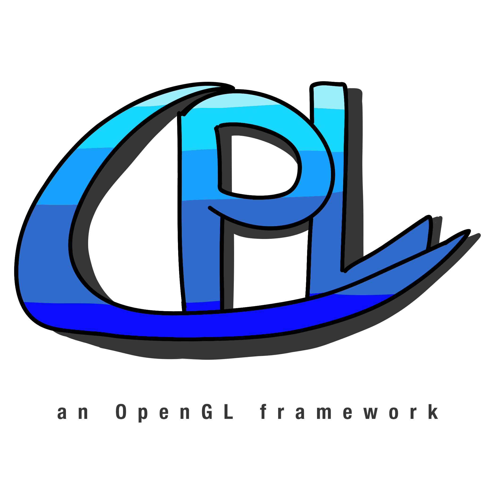

# CPLibrary (CPL)

## About
CPL (named by me) is my custom framework made from scratch. This framework is entirely written \
in C++ and uses OpenGL & other low-level libraries like GLFW, GLAD, STBImage etc. \
Currently I worked on this just for around 3 months

## Example code
```
#include "../CPLibrary/CPLibrary.h"

using namespace CPL;
PRIORITIZE_GPU_BY_VENDOR // optional

int main() {
    InitWindow({800, 600}, "Welcome to CPL");

    while (!WindowShouldClose()) {
        UpdateCPL();

        ClearBackground(BLACK);
        
        BeginDraw(DrawModes::SHAPE_2D, true);
        DrawRect({0, 0}, {100, 100}, RED);

        BeginDraw(DrawModes::TEXT, false);
        DrawText({GetScreenWidth() / 2, GetScreenHeight() / 2}, 
            1.0f, "Hello OpenGL", WHITE);

        EndDraw();
        EndFrame();
    }

    CloseWindow();
}
```

This will be the result if you start the program with the given code:


A proper example code for 3D can be found inside the `example3D/` folder and for 2D inside `example2D/`! Currently there is also a Minecraft Clone, a project of mine I am working on inside `src/` but probably I will make a seperate project out of it.

As you can see, the functions and naming conventions are pretty similar \
and inspired by the ones from Raylib

## Games/Projects where I used CPL
It is not much yet but these are the projects and their link to GitHub:

> [!IMPORTANT]
> All these project use an older version of CPL so do not get confused by that

- [Flappy Bird Clone](https://github.com/ColinIndieDev/Flappy-Bird-Clone)
- [Digit Recognition AI](https://github.com/ColinIndieDev/Digit-Recognition-AI)

There is also a demo here a Minecraft Clone made using my framework, you can find it inside the `src/` folder! \
Here are some screenshots:


## Structure
+ `assets/`
+ + `fonts/`
+ + `images/`
+ + `shaders/`
+ + + `default/`
+ + + + `frag/*.frag`
+ + + + `vert/*.vert`
+ + + `web/`
+ + + + `frag/*.frag`
+ + + + `vert/*.vert` 
+ `external/`
+ + `glad/`
+ `CPLibrary/`
+ + `include/`
+ + `src/`
+ + `CPLibrary.h`

The `assets/` folder is important since it contains the default font of the framework if the user has not chosen one and the shader code. In `external/` is the implementation from `glad/` downloaded from its offical website.
All code for the shaders like fragment as well as vertex are all stored inside the
`shader/` folder and sorted (in assets as mentioned before). All `.h` and `.cpp` files for CPL are seperated. Inside `shapes2D/`, classes of primitves (rectangle, circle etc.), textures & screen quad
are contained and in `shapes3D/` the 3D related stuff needed. `Engine.h` & `.cpp` have all implementations of the functions that are available for the framework which can be used by wrappers basically in `CPL.h` and `.cpp`. The others should be self explaining I guess by their names.

## Functionality
CPL currently supports 2D, but 3D as well which isn't fully completed yet. \
Since CPL is written in C++ and open source, you may look up the code \
and modify it potentially for personal use. Besides of making games
for Desktop (Windows & Linux), the framework + the code can be converted \
to Web with Emscripten.

2D:
- Primitives (Lines, Rectangles, Circles etc.)
- Textures
- Text + Fonts
- Tilemaps
- Particle System

3D:
- 3D shapes (Cubes & Spheres)
- 3D textures (Cubes & Planes)
- Cubemaps
- Directional shadows (Shadow Map)

Both:
- Camera
- Lighting
- Post Processing
  
Others:
- Random number generator wrapper
- Key and Mouse Inputs
- Sounds & Music
- Timer
- Tools
  - OpenGL debugger
  - Logging
  - Scoped timer

It is recommended to take a look at the example projects / demonstrations which will show core functionalities and how to use them correctly. Alternatively you may look up the functions inside the documentation but note that it may contains minor mistakes or is outdated. I will keep my best to refresh and update it regularily!

## Used libraries
- GLAD
> Provides OpenGL functions

- GLFW
> Window and Input

- STB Image
> Textures

- Freetype
> Text & Fonts

- Miniaudio
> Sounds and Music
